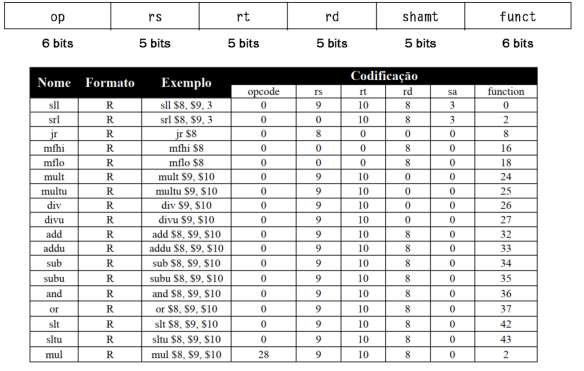
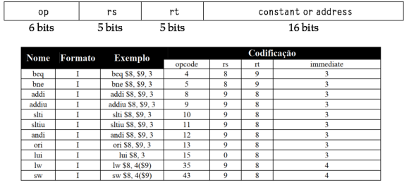
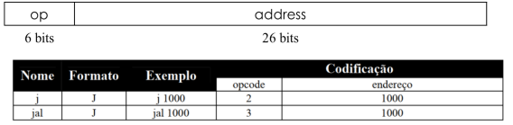

# Simple assembler to MIPS machine code

## Assembler that receives an .asm file and returns a .bin file with each line containing a 32 bits binary string representing the translated command to machine code in the equivalent line on the .asm file

---

## Entry example

```asm
L1: add $8, $17, $18
L2: addi $9, $19, 7
    beq $8, $9, L1
    j L2
```

## Output

```bin
00000010001100100100000000100000
00100010011010010000000000000111
00010001000010010000000000000001
00001000000000000000000000000010
```

---

## Input Rules

- Labels must have a colon between it and the command
- The registers follow the pattern `$x` where `x` is the register address
  - Example: $s1 = $17

## Binary formats for each table

### R Table



### I Table



### J Table


